# PLAN: IETF HTTP API RateLimit Headers Implementation

Design for implementing [draft-ietf-httpapi-ratelimit-headers-10](https://datatracker.ietf.org/doc/draft-ietf-httpapi-ratelimit-headers/) as a `reqwest-ratelimit` compatible middleware, backed by `governor`.

---

## The Problem

When you make HTTP requests to an API, you're subject to rate limits. Today, every API communicates these limits differently:

- GitHub uses `x-ratelimit-remaining`
- GitLab uses `RateLimit-Remaining`
- Some APIs use `retry-after`
- Many APIs don't tell you anything until you hit a 429

The IETF draft standardizes this with two headers that work together:

**`RateLimit-Policy`** — "Here are my rules" (static configuration)
```http
RateLimit-Policy: "burst";q=100;w=60, "daily";q=1000;w=86400
```
*Translation: You get 100 requests per minute (burst), and 1000 per day (daily).*

**`RateLimit`** — "Here's where you stand" (dynamic state)
```http
RateLimit: "burst";r=45;t=30, "daily";r=850
```
*Translation: You have 45 burst requests left (resets in 30s), and 850 daily left.*

---

## What We're Building

A rate limiting system that:

1. **Learns from responses** — Parses the new standard headers to discover an API's policies
2. **Enforces multiple limits** — An API might have burst, hourly, AND daily limits all at once
3. **Smooths request flow** — Instead of bursting then waiting, spread requests evenly
4. **Works per-origin** — Each API domain gets its own rate limiter
5. **Plugs into reqwest** — Drop-in middleware for any reqwest-based HTTP client

---

## Goals

1. Parse `RateLimit-Policy` and `RateLimit` headers per the IETF draft
2. Maintain multiple governors per origin (one per policy/time-window)
3. Provide a smoother that distributes requests across the fastest window
4. Clean separation between origin registry and HTTP API rate limiter
5. Expose `reqwest_ratelimit::RateLimiter` trait for middleware integration

---

## The Core Insight: Multiple Time Windows

The key challenge is that APIs often have **overlapping rate limits at different time scales**:

```
┌─────────────────────────────────────────────────────────────────────┐
│                           24 hours                                  │
│  ┌───────────────────────────────────────────────────────────────┐  │
│  │                    Daily limit: 10,000                        │  │
│  │  ┌─────────┐ ┌─────────┐ ┌─────────┐         ┌─────────┐      │  │
│  │  │  Hour 1 │ │  Hour 2 │ │  Hour 3 │   ...   │ Hour 24 │      │  │
│  │  │ 500/hr  │ │ 500/hr  │ │ 500/hr  │         │ 500/hr  │      │  │
│  │  │┌──┐┌──┐ │ │         │ │         │         │         │      │  │
│  │  ││  ││  │ │ │         │ │         │         │         │      │  │
│  │  │└──┘└──┘ │ │         │ │         │         │         │      │  │
│  │  │ 60/min  │ │         │ │         │         │         │      │  │
│  │  └─────────┘ └─────────┘ └─────────┘         └─────────┘      │  │
│  └───────────────────────────────────────────────────────────────┘  │
└─────────────────────────────────────────────────────────────────────┘
```

A request must pass **ALL** limits to proceed. If you've hit your per-minute burst limit, you wait—even if daily quota is fine. This requires coordinating multiple governors.

---

## Architecture Overview

```
┌─────────────────────────────────────────────────────────────────┐
│                     reqwest-middleware                          │
│  ┌───────────────────────────────────────────────────────────┐  │
│  │              HttpApiRateLimitMiddleware                   │  │
│  │  ┌─────────────────────┐  ┌────────────────────────────┐  │  │
│  │  │   OriginRegistry    │  │   RateLimitHeaderParser    │  │  │
│  │  │  (domain → Limiter) │  │   (parse Policy/RateLimit) │  │  │
│  │  └─────────┬───────────┘  └────────────┬───────────────┘  │  │
│  │            │                           │                   │  │
│  │            ▼                           ▼                   │  │
│  │  ┌─────────────────────────────────────────────────────┐  │  │
│  │  │              OriginRateLimiter                      │  │  │
│  │  │  ┌────────────┐  ┌────────────┐  ┌──────────────┐   │  │  │
│  │  │  │ PolicySlot │  │ PolicySlot │  │  PolicySlot  │   │  │  │
│  │  │  │  "burst"   │  │  "daily"   │  │   "custom"   │   │  │  │
│  │  │  │  100/60s   │  │  1000/day  │  │   500/hour   │   │  │  │
│  │  │  └─────┬──────┘  └──────┬─────┘  └──────┬───────┘   │  │  │
│  │  │        │                │               │           │  │  │
│  │  │        ▼                ▼               ▼           │  │  │
│  │  │  ┌──────────────────────────────────────────────┐   │  │  │
│  │  │  │                   Smoother                   │   │  │  │
│  │  │  │   (divides fastest window into micro-slots)  │   │  │  │
│  │  │  │         governor @ 2s intervals              │   │  │  │
│  │  │  └──────────────────────────────────────────────┘   │  │  │
│  │  └─────────────────────────────────────────────────────┘  │  │
│  └───────────────────────────────────────────────────────────┘  │
└─────────────────────────────────────────────────────────────────┘
```

The **Origin Registry** is the separation barrier—it maps domains to their rate limiters. The HTTP middleware only talks to the registry; it doesn't know about governors or policies.

```mermaid
flowchart TB
    subgraph Client["HTTP Client"]
        MW[HttpApiRateLimitMiddleware]
    end

    subgraph Registry["Origin Registry"]
        direction TB
        REG[("Domain → Limiter<br/>Mapping")]

        subgraph Origin1["api.github.com"]
            ORL1[OriginRateLimiter]
        end

        subgraph Origin2["api.gitlab.com"]
            ORL2[OriginRateLimiter]
        end
    end

    MW --> REG
    REG --> Origin1
    REG --> Origin2

    style Client fill:#e1f5fe
    style Registry fill:#fff3e0
    style Origin1 fill:#e8f5e9
    style Origin2 fill:#e8f5e9
```



---

## Inside an Origin Rate Limiter

Each origin (like `api.github.com`) gets its own rate limiter that manages multiple policies:

```mermaid
flowchart TB
    subgraph ORL["OriginRateLimiter for api.github.com"]
        direction TB

        subgraph Policies["Policy Slots (from RateLimit-Policy header)"]
            P1["🔥 Burst Policy<br/>100 req / 60 sec"]
            P2["⏰ Hourly Policy<br/>5000 req / hour"]
            P3["📅 Daily Policy<br/>15000 req / day"]
        end

        subgraph Governors["Governor per Policy"]
            G1[/"Governor<br/>~1.7 req/sec"/]
            G2[/"Governor<br/>~1.4 req/sec"/]
            G3[/"Governor<br/>~0.17 req/sec"/]
        end

        SM["🎚️ Smoother<br/>Paces based on fastest policy"]

        P1 --> G1
        P2 --> G2
        P3 --> G3

        G1 --> SM
        G2 --> SM
        G3 --> SM
    end

    REQ([Incoming Request]) --> ORL
    ORL --> |"All governors pass"| SEND([Send Request])
    ORL --> |"Any governor blocks"| WAIT([Wait])
```



**Request flow:**
1. Request comes in for `api.github.com`
2. Check each policy's governor—ALL must allow
3. Check the smoother—prevents micro-bursts
4. If any blocks, wait for the shortest wait time
5. Proceed when all allow

---

## The Smoother: Evening Out Request Flow

Without smoothing, you might send all 100 requests in 2 seconds, then wait 58 seconds. The smoother divides the window into micro-intervals:

```
Without Smoother (bursting):
├────────────────── 60 second window ──────────────────┤
█████░░░░░░░░░░░░░░░░░░░░░░░░░░░░░░░░░░░░░░░░░░░░░░░░░░
↑ All 100 requests fired immediately, then wait

With Smoother (2-second intervals):
├────────────────── 60 second window ──────────────────┤
███ ███ ███ ███ ███ ███ ███ ███ ███ ███ ███ ███ ███ ███
↑ ~3-4 requests every 2 seconds, steady flow
```

---

## Request Lifecycle


---

## Data Flow: Headers to Governors


**Key insight:** The `RateLimit-Policy` header tells us the rules (quota, window). The `RateLimit` header tells us where we stand (remaining, reset time). We use both to configure governors that enforce the limits.

---

## Module Structure

```
httpapi-ratelimit/
├── src/
│   ├── lib.rs                 # Public API, re-exports
│   ├── parser.rs              # RateLimit-Policy / RateLimit header parsing
│   ├── policy.rs              # Policy and ServiceLimit types
│   ├── origin_registry.rs     # Domain → OriginRateLimiter mapping
│   ├── origin_limiter.rs      # Multi-policy governor coordination
│   ├── policy_slot.rs         # Single policy's governor + state
│   ├── smoother.rs            # Micro-interval smoothing layer
│   └── middleware.rs          # reqwest-ratelimit integration
```

---

## Core Types

### Policy (from `RateLimit-Policy` header)

```rust
/// Parsed from: `RateLimit-Policy: "burst";q=100;w=60`
#[derive(Debug, Clone)]
pub struct Policy {
    pub name: String,           // e.g., "burst", "daily"
    pub quota: u32,             // q parameter
    pub window_secs: Option<u32>, // w parameter (None = unspecified)
    pub quota_unit: QuotaUnit,  // qu parameter
    pub partition_key: Option<Vec<u8>>, // pk parameter (base64-decoded)
}

#[derive(Debug, Clone, Default)]
pub enum QuotaUnit {
    #[default]
    Requests,
    ContentBytes,
    ConcurrentRequests,
}
```

### ServiceLimit (from `RateLimit` header)

```rust
/// Parsed from: `RateLimit: "burst";r=45;t=55`
#[derive(Debug, Clone)]
pub struct ServiceLimit {
    pub name: String,           // References policy name
    pub remaining: u32,         // r parameter
    pub reset_secs: Option<u32>, // t parameter
    pub partition_key: Option<Vec<u8>>,
}
```

### PolicySlot (governor wrapper for one policy)

**Responsibilities:**
- Wraps one governor for one policy
- Tracks remaining quota and reset time
- Rebuilds governor when remaining changes significantly

```rust
use governor::{RateLimiter, Quota, clock::DefaultClock, state::InMemoryState};
use std::num::NonZeroU32;

pub struct PolicySlot {
    pub policy: Policy,
    pub remaining: u32,
    pub reset_at: Option<Instant>,

    // Governor for this policy's time window
    governor: RateLimiter<
        governor::state::NotKeyed,
        InMemoryState,
        DefaultClock
    >,

    // Tracks what quota the governor was built for
    governor_quota: (u32, u32),  // (remaining, window_secs)
}

impl PolicySlot {
    pub fn new(policy: Policy) -> Self {
        let quota = Self::compute_quota(&policy, policy.quota);
        Self {
            remaining: policy.quota,
            reset_at: None,
            governor: RateLimiter::direct(quota),
            governor_quota: (policy.quota, policy.window_secs.unwrap_or(60)),
            policy,
        }
    }

    fn compute_quota(policy: &Policy, remaining: u32) -> Quota {
        let window = policy.window_secs.unwrap_or(60);
        let per_second = NonZeroU32::new(
            (remaining as f64 / window as f64).ceil() as u32
        ).unwrap_or(NonZeroU32::MIN);

        Quota::per_second(per_second)
    }

    /// Update from RateLimit header
    pub fn update(&mut self, limit: &ServiceLimit) {
        self.remaining = limit.remaining;

        if let Some(reset_secs) = limit.reset_secs {
            self.reset_at = Some(Instant::now() + Duration::from_secs(reset_secs as u64));
        }

        // Rebuild governor if remaining changed significantly
        self.maybe_rebuild_governor();
    }

    fn maybe_rebuild_governor(&mut self) {
        let window = self.policy.window_secs.unwrap_or(60);
        let (old_rem, old_window) = self.governor_quota;

        // Rebuild if remaining dropped by 20% or window changed
        let should_rebuild = old_window != window
            || self.remaining < old_rem.saturating_sub(old_rem / 5);

        if should_rebuild {
            let quota = Self::compute_quota(&self.policy, self.remaining);
            self.governor = RateLimiter::direct(quota);
            self.governor_quota = (self.remaining, window);
        }
    }

    /// Check if this policy allows a request
    pub fn check(&self) -> Result<(), Duration> {
        self.governor.check()
            .map_err(|not_until| not_until.wait_time_from(Instant::now()))
    }

    /// Async wait until allowed
    pub async fn wait(&self) {
        self.governor.until_ready().await;
    }
}
```

---

## Smoother

The smoother divides the fastest policy window into micro-intervals, spreading requests evenly and preventing bursts.

**Responsibilities:**
- Divides fastest window into micro-intervals
- Applies velocity factor
- Prevents bursting behavior

```rust
pub struct Smoother {
    /// Governor for micro-interval pacing
    governor: RateLimiter<
        governor::state::NotKeyed,
        InMemoryState,
        DefaultClock
    >,

    /// The base interval we're dividing (e.g., 60s for a per-minute policy)
    base_window_secs: u32,

    /// Micro-interval duration (e.g., 2 seconds)
    micro_interval_secs: u32,

    /// Velocity multiplier (1.0 = spread evenly, 2.0 = race at 2x speed)
    velocity: f64,

    /// Current configuration
    config: SmootherConfig,
}

#[derive(Clone)]
pub struct SmootherConfig {
    /// How many seconds each micro-interval spans
    pub micro_interval_secs: u32,  // default: 2

    /// Velocity factor (1.0 = even spread, >1.0 = faster completion)
    pub velocity: f64,  // default: 1.5
}

impl Default for SmootherConfig {
    fn default() -> Self {
        Self {
            micro_interval_secs: 2,
            velocity: 1.5,
        }
    }
}

impl Smoother {
    pub fn new(config: SmootherConfig) -> Self {
        Self {
            governor: RateLimiter::direct(Quota::per_second(NonZeroU32::MIN)),
            base_window_secs: 60,
            micro_interval_secs: config.micro_interval_secs,
            velocity: config.velocity,
            config,
        }
    }

    /// Reconfigure based on the fastest policy window and remaining quota
    pub fn configure(&mut self, remaining: u32, window_secs: u32) {
        self.base_window_secs = window_secs;

        // How many micro-intervals in the window?
        let intervals = window_secs / self.micro_interval_secs;

        // Requests per micro-interval, with velocity boost
        let per_interval = (remaining as f64 / intervals as f64 * self.velocity)
            .ceil() as u32;

        // Convert to per-second rate for governor
        let per_second = per_interval as f64 / self.micro_interval_secs as f64;
        let rps = NonZeroU32::new(per_second.ceil() as u32).unwrap_or(NonZeroU32::MIN);

        self.governor = RateLimiter::direct(Quota::per_second(rps));
    }

    /// Check if smoother allows a request
    pub fn check(&self) -> Result<(), Duration> {
        self.governor.check()
            .map_err(|not_until| not_until.wait_time_from(Instant::now()))
    }

    /// Async wait until smoother allows
    pub async fn wait(&self) {
        self.governor.until_ready().await;
    }
}
```

### Smoother Velocity Examples

| Velocity | Behavior |
|----------|----------|
| 0.5 | Conservative: use only half the quota rate |
| 1.0 | Even spread: finish exactly at window end |
| 1.5 | Default: race ahead, finish 33% early |
| 2.0 | Aggressive: finish 50% early, leave buffer |

---

## OriginRateLimiter (Multi-Policy Coordinator)

**Responsibilities:**
- Holds multiple PolicySlots (one per policy name)
- Coordinates "all must pass" logic
- Owns the smoother for this origin

```rust
use std::collections::HashMap;

pub struct OriginRateLimiter {
    /// Policy slots keyed by policy name
    slots: HashMap<String, PolicySlot>,

    /// Smoother for micro-interval pacing
    smoother: Smoother,

    /// Track the fastest (smallest window) policy for smoother
    fastest_policy: Option<String>,
}

impl OriginRateLimiter {
    pub fn new(smoother_config: SmootherConfig) -> Self {
        Self {
            slots: HashMap::new(),
            smoother: Smoother::new(smoother_config),
            fastest_policy: None,
        }
    }

    /// Update policies from RateLimit-Policy header
    pub fn update_policies(&mut self, policies: Vec<Policy>) {
        for policy in policies {
            self.slots.entry(policy.name.clone())
                .and_modify(|slot| slot.policy = policy.clone())
                .or_insert_with(|| PolicySlot::new(policy));
        }

        self.recalculate_fastest();
    }

    /// Update limits from RateLimit header
    pub fn update_limits(&mut self, limits: Vec<ServiceLimit>) {
        for limit in limits {
            if let Some(slot) = self.slots.get_mut(&limit.name) {
                slot.update(&limit);
            }
        }

        self.reconfigure_smoother();
    }

    fn recalculate_fastest(&mut self) {
        self.fastest_policy = self.slots.values()
            .filter_map(|s| s.policy.window_secs.map(|w| (s.policy.name.clone(), w)))
            .min_by_key(|(_, w)| *w)
            .map(|(name, _)| name);
    }

    fn reconfigure_smoother(&mut self) {
        if let Some(ref name) = self.fastest_policy {
            if let Some(slot) = self.slots.get(name) {
                let window = slot.policy.window_secs.unwrap_or(60);
                self.smoother.configure(slot.remaining, window);
            }
        }
    }

    /// Check ALL policies + smoother. Returns first violation.
    pub fn check(&self) -> Result<(), RateLimitViolation> {
        // Check smoother first (fastest)
        self.smoother.check()
            .map_err(|wait| RateLimitViolation::Smoothed { wait_duration: wait })?;

        // Check each policy
        for (name, slot) in &self.slots {
            slot.check().map_err(|wait| RateLimitViolation::PolicyExceeded {
                policy_name: name.clone(),
                wait_duration: wait,
            })?;
        }

        Ok(())
    }

    /// Async wait until ALL policies allow a request
    pub async fn wait(&self) {
        // Wait for smoother
        self.smoother.wait().await;

        // Wait for all policies (in parallel would be ideal, but sequential is safer)
        for slot in self.slots.values() {
            slot.wait().await;
        }
    }
}

#[derive(Debug, Clone)]
pub enum RateLimitViolation {
    Smoothed { wait_duration: Duration },
    PolicyExceeded { policy_name: String, wait_duration: Duration },
}
```

---

## OriginRegistry (Separation Barrier)

Clean separation between origin/domain lookup and rate limiting logic.

**Responsibilities:**
- Maps domains to their OriginRateLimiter
- Creates new limiters on first request to a domain
- Thread-safe concurrent access

```rust
use std::collections::HashMap;
use std::sync::Arc;
use tokio::sync::RwLock;
use url::Url;

pub struct OriginRegistry {
    /// Map of origin (scheme://host:port) to rate limiter
    limiters: Arc<RwLock<HashMap<String, Arc<RwLock<OriginRateLimiter>>>>>,

    /// Default smoother config for new origins
    smoother_config: SmootherConfig,
}

impl OriginRegistry {
    pub fn new(smoother_config: SmootherConfig) -> Self {
        Self {
            limiters: Arc::new(RwLock::new(HashMap::new())),
            smoother_config,
        }
    }

    /// Extract origin from URL
    fn origin_key(url: &Url) -> String {
        format!("{}://{}", url.scheme(), url.host_str().unwrap_or("unknown"))
    }

    /// Get or create rate limiter for origin
    pub async fn get_limiter(&self, url: &Url) -> Arc<RwLock<OriginRateLimiter>> {
        let key = Self::origin_key(url);

        // Fast path: read lock
        {
            let limiters = self.limiters.read().await;
            if let Some(limiter) = limiters.get(&key) {
                return Arc::clone(limiter);
            }
        }

        // Slow path: write lock, create new
        let mut limiters = self.limiters.write().await;
        limiters.entry(key)
            .or_insert_with(|| Arc::new(RwLock::new(
                OriginRateLimiter::new(self.smoother_config.clone())
            )))
            .clone()
    }

    /// Update limiter from response headers
    pub async fn update_from_response(&self, url: &Url, headers: &http::HeaderMap) {
        let limiter = self.get_limiter(url).await;
        let mut limiter = limiter.write().await;

        // Parse RateLimit-Policy header
        if let Some(policies) = parse_policy_header(headers) {
            limiter.update_policies(policies);
        }

        // Parse RateLimit header
        if let Some(limits) = parse_limit_header(headers) {
            limiter.update_limits(limits);
        }
    }
}
```

---

## Header Parser

**Responsibilities:**
- Parses RFC 8941 structured field syntax
- Extracts Policy and ServiceLimit from headers
- Handles legacy header formats as fallback

```rust
use http::HeaderMap;

/// Parse `RateLimit-Policy: "name";q=100;w=60`
pub fn parse_policy_header(headers: &HeaderMap) -> Option<Vec<Policy>> {
    let value = headers.get("ratelimit-policy")?.to_str().ok()?;
    parse_structured_list(value, parse_policy_item)
}

/// Parse `RateLimit: "name";r=45;t=55`
pub fn parse_limit_header(headers: &HeaderMap) -> Option<Vec<ServiceLimit>> {
    let value = headers.get("ratelimit")?.to_str().ok()?;
    parse_structured_list(value, parse_limit_item)
}

fn parse_policy_item(item: &str) -> Option<Policy> {
    // Parse structured field item: "name";q=100;w=60;qu="requests"
    let mut parts = item.split(';');
    let name = parts.next()?.trim().trim_matches('"').to_string();

    let mut policy = Policy {
        name,
        quota: 0,
        window_secs: None,
        quota_unit: QuotaUnit::default(),
        partition_key: None,
    };

    for param in parts {
        let param = param.trim();
        if let Some((key, value)) = param.split_once('=') {
            match key.trim() {
                "q" => policy.quota = value.parse().ok()?,
                "w" => policy.window_secs = value.parse().ok(),
                "qu" => policy.quota_unit = parse_quota_unit(value),
                "pk" => policy.partition_key = parse_base64(value),
                _ => {}
            }
        }
    }

    Some(policy)
}

fn parse_limit_item(item: &str) -> Option<ServiceLimit> {
    let mut parts = item.split(';');
    let name = parts.next()?.trim().trim_matches('"').to_string();

    let mut limit = ServiceLimit {
        name,
        remaining: 0,
        reset_secs: None,
        partition_key: None,
    };

    for param in parts {
        let param = param.trim();
        if let Some((key, value)) = param.split_once('=') {
            match key.trim() {
                "r" => limit.remaining = value.parse().ok()?,
                "t" => limit.reset_secs = value.parse().ok(),
                "pk" => limit.partition_key = parse_base64(value),
                _ => {}
            }
        }
    }

    Some(limit)
}
```

---

## reqwest-ratelimit Middleware Integration

```rust
use reqwest::{Request, Response};
use reqwest_middleware::{Middleware, Next, Result};
use http::Extensions;
use std::sync::Arc;

pub struct HttpApiRateLimitMiddleware {
    registry: Arc<OriginRegistry>,
}

impl HttpApiRateLimitMiddleware {
    pub fn new(smoother_config: SmootherConfig) -> Self {
        Self {
            registry: Arc::new(OriginRegistry::new(smoother_config)),
        }
    }

    pub fn with_registry(registry: Arc<OriginRegistry>) -> Self {
        Self { registry }
    }
}

#[async_trait::async_trait]
impl Middleware for HttpApiRateLimitMiddleware {
    async fn handle(
        &self,
        req: Request,
        extensions: &mut Extensions,
        next: Next<'_>,
    ) -> Result<Response> {
        let url = req.url().clone();

        // Pre-request: wait for rate limit
        let limiter = self.registry.get_limiter(&url).await;
        limiter.read().await.wait().await;

        // Execute request
        let response = next.run(req, extensions).await?;

        // Post-response: update from headers
        self.registry.update_from_response(&url, response.headers()).await;

        Ok(response)
    }
}

// Also implement reqwest_ratelimit::RateLimiter for simpler usage
pub struct HttpApiRateLimiter {
    registry: Arc<OriginRegistry>,
    current_url: Arc<RwLock<Option<Url>>>,
}

impl reqwest_ratelimit::RateLimiter for HttpApiRateLimiter {
    async fn acquire_permit(&self) {
        if let Some(ref url) = *self.current_url.read().await {
            let limiter = self.registry.get_limiter(url).await;
            limiter.read().await.wait().await;
        }
    }
}
```

---

## Integrating with reqwest

The system exposes two integration points:

**1. As reqwest-middleware Middleware** (full featured)
```rust
let client = ClientBuilder::new(reqwest::Client::new())
    .with(HttpApiRateLimitMiddleware::new(config))
    .build();
```

**2. As reqwest-ratelimit RateLimiter** (simpler)
```rust
impl reqwest_ratelimit::RateLimiter for HttpApiRateLimiter {
    async fn acquire_permit(&self) {
        self.registry.get_limiter(&self.url).await
            .wait().await;
    }
}
```

---

## Usage Example

```rust
use reqwest_middleware::ClientBuilder;
use httpapi_ratelimit::{HttpApiRateLimitMiddleware, SmootherConfig};

#[tokio::main]
async fn main() {
    let smoother_config = SmootherConfig {
        micro_interval_secs: 2,
        velocity: 1.5,
    };

    let rate_limit_middleware = HttpApiRateLimitMiddleware::new(smoother_config);

    let client = ClientBuilder::new(reqwest::Client::new())
        .with(rate_limit_middleware)
        .build();

    // First request discovers policies from RateLimit-Policy header
    let resp = client.get("https://api.example.com/data").send().await?;

    // Subsequent requests are rate-limited based on discovered policies
    for i in 0..100 {
        let resp = client.get("https://api.example.com/data").send().await?;
        println!("Request {}: {}", i, resp.status());
    }
}
```

---

## Adaptation to archive-list

To integrate this with the existing archive-list rate limiting system:

### Current Architecture


### Proposed Architecture


### 1. Shared OriginRegistry

Replace the current per-provider `TokenRateLimiter` with a shared `OriginRegistry`:

```rust
// In src/provider/generic.rs
pub struct Provider {
    pub domain: String,
    strategies: Vec<Box<dyn Strategy>>,
    working_strategy: Arc<RwLock<Option<Box<dyn Strategy>>>>,

    // Replace TokenRateLimiter with OriginRegistry reference
    origin_registry: Arc<OriginRegistry>,
    token_manager: Arc<TokenManager>,  // Separate token handling
}
```

### 2. Token + Rate Limit Separation

Split concerns:
- **TokenManager**: Handles token loading, rotation, validation
- **OriginRegistry**: Handles rate limiting per origin (shared across tokens)

```rust
impl Provider {
    async fn fetch_url(&self, url: &str) -> Result<Response> {
        // 1. Get token
        let token = self.token_manager.get_next_token().await;

        // 2. Wait for rate limit (from OriginRegistry)
        let parsed_url = Url::parse(url)?;
        let limiter = self.origin_registry.get_limiter(&parsed_url).await;
        limiter.read().await.wait().await;

        // 3. Make request
        let response = strategy.get_url(url, token.as_deref()).await?;

        // 4. Update rate limits from response
        self.origin_registry.update_from_response(&parsed_url, response.headers()).await;

        // 5. Update token state (remaining, etc.)
        if let Some(ref token_val) = token {
            self.token_manager.update_from_headers(token_val, response.headers()).await;
        }

        Ok(response)
    }
}
```

### 3. Fallback to Auto-Detection

The existing `ratelimit_headers` auto-detection becomes a fallback when `RateLimit-Policy` headers are absent:

```rust
impl OriginRegistry {
    pub async fn update_from_response(&self, url: &Url, headers: &HeaderMap) {
        let limiter = self.get_limiter(url).await;
        let mut limiter = limiter.write().await;

        // Try IETF standard headers first
        if let Some(policies) = parse_policy_header(headers) {
            limiter.update_policies(policies);
        }
        if let Some(limits) = parse_limit_header(headers) {
            limiter.update_limits(limits);
        }

        // Fallback to legacy auto-detection if no standard headers
        if limiter.slots.is_empty() {
            let legacy_info = crate::util::detect_rate_limits(headers);
            limiter.update_from_legacy(legacy_info);
        }
    }
}
```

### Migration Path

| Phase | Change |
|-------|--------|
| 1 | Extract OriginRegistry as separate module |
| 2 | Update Provider to use OriginRegistry + TokenManager |
| 3 | Add IETF header parsing alongside auto-detection |
| 4 | Expose as standalone `httpapi-ratelimit` crate |

### What Carries Over

| archive-list Concept | IETF Design Equivalent |
|---------------------|------------------------|
| Per-token governor | Per-policy governor (PolicySlot) |
| Velocity multiplier | Smoother velocity |
| Auto-detect headers | Fallback when no standard headers |
| `mark_rate_limited()` | Update from RateLimit header |

---

## References

- [IETF Draft: RateLimit Headers](https://datatracker.ietf.org/doc/draft-ietf-httpapi-ratelimit-headers/)
- [RFC 8941: Structured Field Values](https://www.rfc-editor.org/rfc/rfc8941)
- [governor crate](https://docs.rs/governor)
- [reqwest-ratelimit](https://docs.rs/reqwest-ratelimit)
- [reqwest-middleware](https://docs.rs/reqwest-middleware)
