# PLAN: IETF HTTP API RateLimit Headers Implementation

An implementation of the emerging [IETF RateLimit headers standard](https://datatracker.ietf.org/doc/draft-ietf-httpapi-ratelimit-headers/) for Rust HTTP clients. This design targets `reqwest-ratelimit` middleware, using the `governor` crate for enforcement.

---

## The Problem

When you make HTTP requests to an API, you're subject to rate limits. Today, every API communicates these limits differently:

- GitHub uses `x-ratelimit-remaining`
- GitLab uses `RateLimit-Remaining`
- Some APIs use `retry-after`
- Many APIs don't tell you anything until you hit a 429

The IETF draft standardizes this with two headers that work together:

**`RateLimit-Policy`** — "Here are my rules" (static configuration)
```http
RateLimit-Policy: "burst";q=100;w=60, "daily";q=1000;w=86400
```
*Translation: You get 100 requests per minute (burst), and 1000 per day (daily).*

**`RateLimit`** — "Here's where you stand" (dynamic state)
```http
RateLimit: "burst";r=45;t=30, "daily";r=850
```
*Translation: You have 45 burst requests left (resets in 30s), and 850 daily left.*

---

## What We're Building

A rate limiting system that:

1. **Learns from responses** — Parses the new standard headers to discover an API's policies
2. **Enforces multiple limits** — An API might have burst, hourly, AND daily limits all at once
3. **Smooths request flow** — Instead of bursting then waiting, spread requests evenly
4. **Works per-origin** — Each API domain gets its own rate limiter
5. **Plugs into reqwest** — Drop-in middleware for any reqwest-based HTTP client

---

## The Core Insight: Multiple Time Windows

The key challenge is that APIs often have **overlapping rate limits at different time scales**:

```
┌─────────────────────────────────────────────────────────────────────┐
│                           24 hours                                  │
│  ┌───────────────────────────────────────────────────────────────┐  │
│  │                    Daily limit: 10,000                        │  │
│  │  ┌─────────┐ ┌─────────┐ ┌─────────┐         ┌─────────┐      │  │
│  │  │  Hour 1 │ │  Hour 2 │ │  Hour 3 │   ...   │ Hour 24 │      │  │
│  │  │ 500/hr  │ │ 500/hr  │ │ 500/hr  │         │ 500/hr  │      │  │
│  │  │┌──┐┌──┐ │ │         │ │         │         │         │      │  │
│  │  ││  ││  │ │ │         │ │         │         │         │      │  │
│  │  │└──┘└──┘ │ │         │ │         │         │         │      │  │
│  │  │ 60/min  │ │         │ │         │         │         │      │  │
│  │  └─────────┘ └─────────┘ └─────────┘         └─────────┘      │  │
│  └───────────────────────────────────────────────────────────────┘  │
└─────────────────────────────────────────────────────────────────────┘
```

A request must pass **ALL** limits to proceed. If you've hit your per-minute burst limit, you wait—even if daily quota is fine. This requires coordinating multiple governors.

---

## Architecture

```mermaid
flowchart TB
    subgraph Client["HTTP Client"]
        MW[HttpApiRateLimitMiddleware]
    end
    
    subgraph Registry["Origin Registry"]
        direction TB
        REG[("Domain → Limiter<br/>Mapping")]
        
        subgraph Origin1["api.github.com"]
            ORL1[OriginRateLimiter]
        end
        
        subgraph Origin2["api.gitlab.com"]
            ORL2[OriginRateLimiter]
        end
    end
    
    MW --> REG
    REG --> Origin1
    REG --> Origin2
    
    style Client fill:#e1f5fe
    style Registry fill:#fff3e0
    style Origin1 fill:#e8f5e9
    style Origin2 fill:#e8f5e9
```



The **Origin Registry** is the separation barrier—it maps domains to their rate limiters. The HTTP middleware only talks to the registry; it doesn't know about governors or policies.

---

## Inside an Origin Rate Limiter

Each origin (like `api.github.com`) gets its own rate limiter that manages multiple policies:

```mermaid
flowchart TB
    subgraph ORL["OriginRateLimiter for api.github.com"]
        direction TB
        
        subgraph Policies["Policy Slots (from RateLimit-Policy header)"]
            P1["🔥 Burst Policy<br/>100 req / 60 sec"]
            P2["⏰ Hourly Policy<br/>5000 req / hour"]
            P3["📅 Daily Policy<br/>15000 req / day"]
        end
        
        subgraph Governors["Governor per Policy"]
            G1[/"Governor<br/>~1.7 req/sec"/]
            G2[/"Governor<br/>~1.4 req/sec"/]
            G3[/"Governor<br/>~0.17 req/sec"/]
        end
        
        SM["🎚️ Smoother<br/>Paces based on fastest policy"]
        
        P1 --> G1
        P2 --> G2
        P3 --> G3
        
        G1 --> SM
        G2 --> SM
        G3 --> SM
    end
    
    REQ([Incoming Request]) --> ORL
    ORL --> |"All governors pass"| SEND([Send Request])
    ORL --> |"Any governor blocks"| WAIT([Wait])
```



**Request flow:**
1. Request comes in for `api.github.com`
2. Check each policy's governor—ALL must allow
3. Check the smoother—prevents micro-bursts
4. If any blocks, wait for the shortest wait time
5. Proceed when all allow

---

## The Smoother: Evening Out Request Flow

Without smoothing, you might send all 100 requests in 2 seconds, then wait 58 seconds. The smoother divides the window into micro-intervals:

```
Without Smoother (bursting):
├────────────────── 60 second window ──────────────────┤
█████░░░░░░░░░░░░░░░░░░░░░░░░░░░░░░░░░░░░░░░░░░░░░░░░░░
↑ All 100 requests fired immediately, then wait

With Smoother (2-second intervals):
├────────────────── 60 second window ──────────────────┤
███ ███ ███ ███ ███ ███ ███ ███ ███ ███ ███ ███ ███ ███
↑ ~3-4 requests every 2 seconds, steady flow
```

The **velocity** parameter lets you race ahead of the even spread:

| Velocity | Behavior |
|----------|----------|
| 0.5 | Conservative—use half the available rate |
| 1.0 | Even spread—finish exactly as window closes |
| 1.5 | Default—finish 33% early, leave safety buffer |
| 2.0 | Aggressive—finish 50% early |

---

## Request Lifecycle


---

## Data Flow: Headers to Governors


**Key insight:** The `RateLimit-Policy` header tells us the rules (quota, window). The `RateLimit` header tells us where we stand (remaining, reset time). We use both to configure governors that enforce the limits.

---

## Component Responsibilities

### Origin Registry
- Maps domains to their OriginRateLimiter
- Creates new limiters on first request to a domain
- Thread-safe concurrent access

### OriginRateLimiter  
- Holds multiple PolicySlots (one per policy name)
- Coordinates "all must pass" logic
- Owns the smoother for this origin

### PolicySlot
- Wraps one governor for one policy
- Tracks remaining quota and reset time
- Rebuilds governor when remaining changes significantly

### Smoother
- Divides fastest window into micro-intervals
- Applies velocity factor
- Prevents bursting behavior

### Header Parser
- Parses RFC 8941 structured field syntax
- Extracts Policy and ServiceLimit from headers
- Handles legacy header formats as fallback

---

## Module Structure

```
httpapi-ratelimit/
├── lib.rs                 # Public API
├── parser.rs              # Header parsing (RFC 8941 structured fields)
├── policy.rs              # Policy, ServiceLimit types
├── origin_registry.rs     # Domain → Limiter mapping
├── origin_limiter.rs      # Multi-policy coordination
├── policy_slot.rs         # Single governor + state
├── smoother.rs            # Micro-interval pacing
└── middleware.rs          # reqwest-middleware integration
```

---

## Integrating with reqwest

The system exposes two integration points:

**1. As reqwest-middleware Middleware** (full featured)
```rust
let client = ClientBuilder::new(reqwest::Client::new())
    .with(HttpApiRateLimitMiddleware::new(config))
    .build();
```

**2. As reqwest-ratelimit RateLimiter** (simpler)
```rust
impl reqwest_ratelimit::RateLimiter for HttpApiRateLimiter {
    async fn acquire_permit(&self) {
        self.registry.get_limiter(&self.url).await
            .wait().await;
    }
}
```

---

## Adapting to archive-list

This design can integrate with the existing archive-list rate limiting:

### Current Architecture


### Proposed Architecture


**Key changes:**
1. **Separate concerns** — Token rotation vs rate limiting become independent
2. **Share registry** — Multiple providers can share one OriginRegistry
3. **Standard headers first** — Try IETF headers, fall back to legacy auto-detection

### Migration Path

| Phase | Change |
|-------|--------|
| 1 | Extract OriginRegistry as separate module |
| 2 | Split TokenRateLimiter into TokenManager + rate limiting |
| 3 | Add IETF header parsing alongside auto-detection |
| 4 | Publish as standalone `httpapi-ratelimit` crate |

### What Carries Over

| archive-list Concept | IETF Design Equivalent |
|---------------------|------------------------|
| Per-token governor | Per-policy governor (PolicySlot) |
| Velocity multiplier | Smoother velocity |
| Auto-detect headers | Fallback when no standard headers |
| `mark_rate_limited()` | Update from RateLimit header |

---

## References

- [IETF Draft: RateLimit Headers](https://datatracker.ietf.org/doc/draft-ietf-httpapi-ratelimit-headers/)
- [RFC 8941: Structured Field Values](https://www.rfc-editor.org/rfc/rfc8941)
- [governor crate](https://docs.rs/governor)
- [reqwest-ratelimit](https://docs.rs/reqwest-ratelimit)
- [reqwest-middleware](https://docs.rs/reqwest-middleware)
